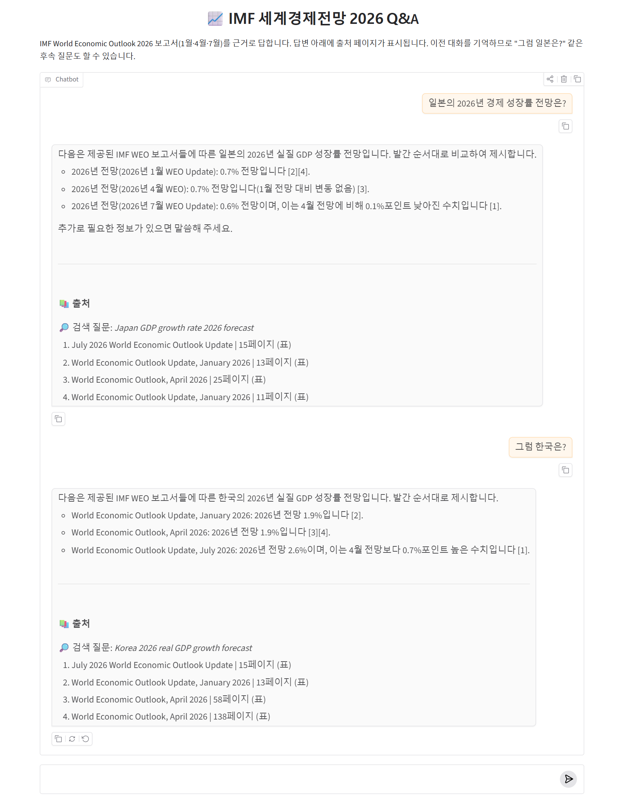

# 📈 IMF 세계경제전망 2026 RAG 챗봇

IMF **World Economic Outlook 2026** 보고서(1월 업데이트 · 4월 정식 보고서 · 7월 업데이트)를 근거로 질문에 답하는 RAG(Retrieval-Augmented Generation) 챗봇입니다.
LangChain + OpenAI + Chroma로 만들고 Gradio로 웹에 띄웁니다.



- 답변마다 **출처(보고서 · 페이지)** 표시
- 보고서에 없는 내용은 지어내지 않고 **"제공된 보고서에서 찾을 수 없습니다"**라고 답변
- 보고서별 수치가 다르면 **발간 시점 순서대로 비교**
- **대화 기억**: "그럼 일본은?" 같은 후속 질문 가능
- **한국어 질문 → 영어 검색어로 재작성**해서 영어 보고서 검색 정확도 향상
- **표 처리**: 표의 각 행을 제목·열 이름이 붙은 문장으로 변환해서 국가별 수치 검색 가능

## 동작 구조

```
[색인: build_index.py — PDF가 바뀔 때만 실행]
data/*.pdf ─ loader.py ─┬─ 일반 페이지 ─ splitter.py (1000자 청크) ─┐
                        └─ 표 페이지 ─── tables.py (GPT로 행 → 문장) ─┴─ vectorstore.py ─▶ chroma_db/

[질의: app.py — 질문할 때마다]
질문 + 대화기록 ─▶ ⓪ 영어 검색어로 재작성 ─▶ ① Chroma 검색 (TOP 4) ─▶ ② 프롬프트 조립 ─▶ ③ GPT 답변 + 출처
```

| 파일 | 역할 |
|---|---|
| `config.py` | 경로, 모델명, 청크 크기, 검색 개수 등 설정값 |
| `loader.py` | `data/` 폴더의 PDF를 페이지 단위 Document로 읽기 |
| `splitter.py` | 페이지를 1000자(겹침 200자) 청크로 자르기 |
| `tables.py` | 표 페이지 감지 → GPT로 행 단위 문장 변환 → 숫자 검증 → 캐시 |
| `vectorstore.py` | OpenAI 임베딩 + Chroma DB 생성/불러오기 |
| `build_index.py` | 위 과정을 한 번에 실행해서 벡터 DB 생성 |
| `rag_chain.py` | 질문 재작성 + 검색 + 프롬프트 + GPT를 LCEL 체인으로 연결 |
| `app.py` | Gradio 채팅 화면 (스트리밍, 출처 표시, 보고서 선택) |
| `compare_search.py` | 한국어 검색 vs 영어 재작성 검색 비교 실험 |
| `requirements.txt` | 필요한 라이브러리 (테스트한 버전으로 고정) |
| `.env.example` | API 키 설정 파일 양식 |
| `docs/` | README용 이미지 |

실행 중에 생기는 파일(저장소에는 없음):

| 파일 | 설명 |
|---|---|
| `.env` | 본인 OpenAI API 키 |
| `chroma_db/` | 벡터 DB (`build_index.py`가 생성) |
| `table_cache.json` | 표 변환 결과 캐시 (다음 `build_index.py` 실행 때 GPT 재호출 없이 재사용) |

## 실행 방법

Python 3.14.2 / Windows 11에서 테스트했습니다.

### 1. 설치

```bash
python -m venv .venv
.venv\Scripts\activate
python -m pip install -r requirements.txt
```

> PowerShell에서 `activate` 실행 시 "스크립트를 실행할 수 없습니다" 오류가 나면, 활성화하지 않고 가상환경의 파이썬을 직접 지정해도 됩니다.
> 예: `.venv\Scripts\python.exe -m pip install -r requirements.txt`, `.venv\Scripts\python.exe app.py`

<details>
<summary>macOS / Linux</summary>

```bash
python3 -m venv .venv
source .venv/bin/activate
python -m pip install -r requirements.txt
cp .env.example .env
```
(macOS / Linux에서는 테스트하지 않았습니다.)
</details>

### 2. API 키 설정

```bash
copy .env.example .env
```
`.env`를 열어 `OPENAI_API_KEY`에 본인 키를 넣습니다.

### 3. PDF 넣기

PDF는 저장소에 포함되어 있지 않습니다. [IMF World Economic Outlook](https://www.imf.org/en/Publications/WEO) 페이지에서 아래 보고서를 받아 `data/` 폴더에 넣으세요. (파일 이름은 자유)

- World Economic Outlook Update, January 2026
- World Economic Outlook, April 2026
- World Economic Outlook Update, July 2026

### 4. 벡터 DB 만들기 (PDF를 바꿨을 때만)

```bash
python build_index.py
```
처음 실행할 때는 표 페이지(43쪽)를 GPT로 변환하느라 4분 정도 걸립니다. 결과는 `table_cache.json`에 저장되어 다음부터는 빠릅니다.

### 5. 앱 실행

```bash
python app.py
```
브라우저에서 http://127.0.0.1:7860 접속

## 사용 모델과 API 사용량

- 임베딩: `text-embedding-3-small`
- 답변 · 질문 재작성 · 표 변환: `gpt-5-mini`

위 PDF 3개(208쪽) 기준으로 측정한 토큰 사용량입니다.

| 작업 | 토큰 사용량 | 대략적인 비용 |
|---|---|---|
| 첫 색인 — 표 변환 (43쪽) | 입력 약 10만 / 출력 약 18만 | 약 0.4달러 |
| 첫 색인 — 임베딩 (문서 2,376개) | 약 39만 | 0.01달러 미만 |
| 이후 색인 (표 변환 캐시 사용) | 임베딩만 | 0.01달러 미만 |
| 질문 1개 | 약 1,500 (본문 위주 답변은 더 많음) | 0.01달러 미만 |

비용은 작성 시점의 가격표로 계산한 추정치입니다. 실제 가격은 [OpenAI 가격표](https://openai.com/api/pricing/)를 확인하세요.

## 만들면서 고민한 점

### 1. 벡터 DB: FAISS 대신 Chroma
처음에는 가장 단순한 FAISS로 계획했지만, **PDF를 여러 개로 늘리기로** 하면서 Chroma로 바꿨습니다.
- **메타데이터 필터**: `filter={"file_name": ...}`로 특정 보고서 안에서만 검색할 수 있어서, 화면의 "검색할 보고서" 메뉴를 쉽게 구현했습니다.
- **고유 ID로 덮어쓰기(upsert)**: 청크마다 `파일명:페이지:시작위치` ID를 붙여서, 색인을 다시 만들어도 중복 저장되지 않습니다.
- LangChain의 FAISS 연결은 유지보수 종료 예정인 `langchain-community`에 있지만, Chroma는 독립 패키지(`langchain-chroma`)로 관리됩니다.

### 2. 청크 크기: 1000자 / 겹침 200자
PDF를 측정해 보니 문장 평균 길이가 약 159자였습니다. 1000자는 문장 6개, 즉 **한두 문단**이라서 IMF 보고서의 "주장 하나 + 근거" 단위와 잘 맞습니다. 겹침 200자(문장 1개 남짓)는 청크 경계에서 잘린 문장이 이웃 청크 중 한쪽에는 온전히 남도록 하기 위한 값입니다.

### 3. 같은 질문에 보고서마다 다른 숫자
"2026년 세계 성장률"은 1월 3.3%, 4월 3.1%, 7월 3.0%로 보고서마다 다릅니다. 청크만 넘기면 GPT가 어느 게 최신 전망인지 알 수 없어서, PDF 메타데이터의 **보고서 제목(발간 월)을 각 청크 앞에 붙여** 넘기고 프롬프트에 "발간 순서대로 비교하라"는 규칙을 넣었습니다. 파일 이름을 바꾸는 것은 검색에 영향이 없고(임베딩되는 것은 본문뿐), GPT에게 넘겨줄 때만 의미가 있다는 점도 확인했습니다.

### 4. 한국어 질문 → 영어 검색어
보고서는 영어, 질문은 한국어라서 검색 결과의 점수 차이가 거의 없었습니다. 예를 들어 "2026년 세계 경제 성장률 전망은?"의 상위 4개 거리는 0.377~0.388로 사실상 같았습니다. 그래서 검색 전에 GPT로 **영어 검색어를 만드는 단계**를 추가했습니다.

| 질문 | 한국어 그대로 | 영어 재작성 |
|---|---|---|
| 한국 경제 전망은 어떤가요? | 0.413 | **0.345** |
| 인공지능 투자 붐이 꺼지면 어떤 일이 생기나요? | 0.542 | **0.348** |
| 중앙은행은 금리를 어떻게 해야 하나요? | 0.741 | **0.421** |
| 2026년 세계 경제 성장률 전망은? | 0.377 | 0.380 (차이 없음) |

(1등 청크의 코사인 거리, 작을수록 질문과 가까움. `compare_search.py`로 측정. 질문 문장이 바뀌면 거리의 기준도 조금 달라지므로 대략적인 비교입니다.)

이 과정에서 프롬프트를 세 번 고쳤습니다.
1. **"IMF 용어를 써라"** → 사용자가 묻지 않은 주제까지 키워드를 50단어 가까이 붙여서 질문의 초점이 흐려졌습니다. → "질문 범위를 벗어나지 말고 짧게" 규칙 추가
2. **"그럼 일본은?"이 오히려 나빠짐** → 검색어에 붙은 "IMF World Economic Outlook"이 원인이었습니다. 모든 문서가 IMF 보고서라서 이 단어는 모든 청크와 똑같이 비슷하고, 정작 중요한 "Japan"의 비중을 희석시켰습니다. 정답 청크가 9위까지 밀렸다가, 이 단어를 빼자 1위로 올라왔습니다. → **"모든 문서에 공통인 단어는 넣지 말라"** 규칙 추가
3. **없는 내용을 지어냄** → 금리 질문에 사용자가 말하지 않은 "Korea"를 붙였습니다. `reasoning_effort`를 `minimal`(약 0.9초)에서 `low`(약 1.7초)로 올리자 사라졌습니다. 검색어가 틀리면 뒤 단계가 모두 틀리므로 속도보다 정확도를 택했습니다.

### 5. 대화 기억은 두 군데에 필요
일반 챗봇은 대화 기록을 GPT에게 넘기기만 하면 되지만, RAG는 **검색 단계**가 따로 있습니다. 검색은 질문 문장 하나만 벡터로 바꾸기 때문에 "그 중에서 첫 번째를 자세히"를 그대로 검색하면 의미 없는 결과가 나옵니다. 그래서 ① 검색 전에 대화 맥락을 채워 넣은 질문으로 **재작성**하고, ② 답변할 때도 대화 기록을 함께 넘깁니다. 토큰이 계속 늘지 않도록 최근 3턴만 넘기고, 화면용 출처 목록은 잘라냅니다.

### 6. 표 처리와 LLM 결과 검증
표를 1000자로 자르면 `Japan –0.2 1.1 0.6 0.7` 같은 숫자 줄이 열 제목(연도)과 떨어져서, 임베딩해도 의미가 없고 GPT도 몇 년도 값인지 알 수 없었습니다. 그래서 색인할 때 표 페이지(표 제목이 있고 숫자 비율 15% 이상인 43쪽)만 골라 **GPT로 "한 행 = 제목·열 이름이 붙은 한 문장"**으로 바꿨습니다.

GPT가 옮긴 숫자를 그대로 믿지 않고, **원문 페이지에 없는 숫자가 들어간 행은 코드로 버리는** 검증 단계를 넣었습니다(1,563행 중 3행 제거). 변환 결과는 캐시에 저장해서 다시 색인할 때 API를 부르지 않습니다. 그 결과 독일 물가, 한국 경상수지처럼 **통계 부록 표에만 있는 정보**도 답할 수 있게 됐고, 몇 개 행은 원문과 직접 대조해 숫자가 맞는지 확인했습니다.

## 알려진 한계

- 표 변환은 GPT가 하므로, 숫자를 **다른 열에 잘못 붙이는** 실수는 검증 단계에서 잡지 못할 수 있습니다. (원문에 없는 숫자는 걸러냄)
- 일부 표 행에서 실제값/전망치 구분 표시가 부정확할 수 있습니다.
- 페이지 머리글이 청크에 섞여 있고, 페이지 경계에서 문장이 끊깁니다.
- `langchain-community`는 유지보수 종료 예정이라 실행 시 경고가 표시됩니다. (동작에는 문제 없음)

## 라이선스와 출처

- 코드: [MIT License](LICENSE)
- 보고서 원문 © International Monetary Fund. 이 저장소는 학습 목적의 RAG 예제이며 IMF와 무관합니다.
